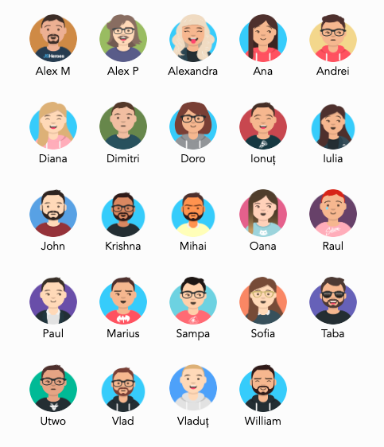

## 👋 Welcome

Hi and welcome to teleportHQ. We know it's your first day at a new company and you might be overwhelmed or confused, so we put together this quick guide to walk you through the onboarding process. We are grateful to have you with us and we hope that your experience will be as pleasant as possible.

Our mission at teleportHQ is to bend technology towards humans, hence one of our core behaviours inside the company is to put **people first**. You might have noticed this from the first interactions that you had with the team. We are trying our best to create a friendly and supportive environment in which everyone can perform at their best. In return, we expect honesty and openness from everyone who is joining. We are actively searching to improve ourselves during the process. Make no mistake, you are part of the team from day 1 and your opinion matters. We kindly ask you to give us feedback whenever something works and even more when something doesn't work.

We hope you'll have a great time working with us and we want to assure you again that the entire team is here to support you in your new journey. So let's get you settled and ready for boarding.

### 😊 Meet your buddy

Each new employee has an on-boarding buddy. Another person in the team who can guide them through the confusions of the first days. Don't hesitate to reach this person whenever you feel like you need their help with something. However, keep in mind that you can always ask someone else in case your buddy is not available. In case of junior positions, buddies also act as mentors and will spend a bit more time with you as you get familiar with the tech stack and the work processes.

### 💯 Meet the team

Being a startup, we don't have a fixed structure with teams and departments. Sometimes roles and responsibilities blend as we work together to make the most of our availability. What you need to know at this point is that there's a number of support roles in the company. These support roles allow us to move forward with less friction. It will become clearer in a couple of days/weeks, but we don't have the traditional managerial structure. Whenever something is unclear, don't hesitate to ask. Furthermore, each person in the team works in a particular role: business, design/user experience, engineering, quality assurance, ai/data science, etc. However, you will see cross-functional teams working towards a common goal so don't take the role as a differentiator between teams.

A better classification would be based on the types of activities we do. At different times, people in teleportHQ work in one of the five areas:
*  **Business Development** - all the effort placed behind funding and long term strategic partnerships
*  **Product Development** - work focused on the customer facing products (mainly the Playground at this point)
*  **Research** - independent tracks focused on developing new capabilities and integrations for the product side
*  **Consultancy** - a separate work track which is not related to the teleportHQ products but it is aimed at attracting funds
*  **Infrastructure** - the bedrock of everything we do, this is where the core work on all our projects is being done.

You can [read additional information](https://teleporthq.io/about) about the team on the website.

### 🌍 Overview of the teleport ecosystem

We have a lot to cover here, but don't worry. Your first meeting will be focused on explaining the bigger picture of what we are doing here. You will have a better understanding of the projects, the responsibilities and the short-mid term as well as the long-term goals. We will also briefly go through the working processes and tools.

### ✅ First task

First day, first task. In all seriousness, let's get your avatar on that team page! Go to [https://getavataaars.com/](https://getavataaars.com/) and customize your teleportHQ avatar. Let us know when you're done and go on reading the rest of the guide.

### 🖥️ Everyday tools

Before you get to the dedicated tools based on your role inside teleportHQ, let's get you familiar with our everyday tools that we use for communication, project management and source code management.

Here are the most important things to consider:
* You will have a teleporthq.io **google** account for mailing and access to other tools.
* You will get an invite to the teleportHQ **slack** organization, which we use for daily communication.
* You will also be invited to the teleportHQ **gitlab** organization, where we store our closed-source projects.
* Finally, you should ask someone in the team to add you to the teleportHQ **github** organization with your personal github account, for access to the open-source projects.

In terms of specific role tooling (eg: code editor, browsers or other applications), please ask your buddy to guide you as there's no standardized approach to this.

### 👟 Next Steps

Alright, let's talk about what you'll be doing in the next couple of days/weeks.

In case you are starting your junior career with us, please check the [junior development path](/junior-development.md).

Other documents that might be of interest:
* [coding guidelines](/coding-guidelines.md)
* [teleportHQ vocabulary](/vocabulary.md)